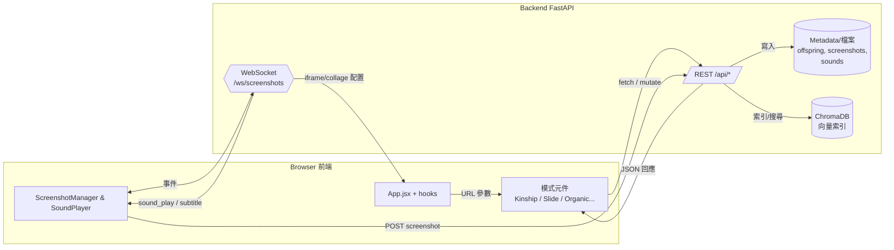

# 前端架構概論（Frontend Architecture Overview）

> 狀態: 與現況程式碼同步  
> 最後更新: 2025-11-15

---

## 1. 技術棧與整體流程

- **基礎環境**：Vite 5 + React 18。`src/main.jsx` 只做 root render，其餘邏輯都集中在 `App.jsx` 與 hooks。
- **3D 與動畫**：three、@react-three/fiber、@react-three/drei 提供 Kinship/Organic 場景；html2canvas + 自行封裝 loader（`utils/html2canvasLoader.js`）負責畫面截圖。
- **狀態處理**：全部以 React hooks 組合；沒有 Redux / MobX。全域的 WebSocket、字幕、截圖等都抽象成 hooks 供模式共用。
- **環境變數**：
  - `VITE_API_BASE`：API base URL，空值時走相對 `/api`。
  - `VITE_IMAGES_BASE`：影像靜態路徑，預設 `/generated_images/`。
  - `VITE_CLIENT_ID`：預設 client id（可被 URL `?client=` 覆寫）。
  - `VITE_IFRAME_PERSIST_QUERY`、`VITE_COLLAGE_PERSIST_QUERY`：決定是否把 iframe/collage 設定寫回 URL。
- **外部互動**：所有資料由 `backend/app` 暴露的 REST / WebSocket `/ws/screenshots` 提供，前端只負責視覺與控制。

---

## 2. 目錄與核心模組

- `src/App.jsx`：解析 URL 參數 → 決定 DisplayMode → 注入對應元件。也是所有 hooks（字幕、WS、截圖、配置、音效、相機預設）的組合點。
- `src/components/`：共用 UI（ControlPanel、ModeLayout、ScreenshotMessage）、Kinship 場景本體（`components/kinship/**`）、搜尋面板等。
- `src/hooks/`：模式判斷 (`useModeParams`)、WebSocket (`useControlSocket`)、截圖 (`useScreenshotManager`)、字幕 (`useSubtitleCaption`)、iframe/collage 設定、相機預設、搜圖、幻燈片播放等。
- `src/utils/`：iframe/collage 設定解析、collage 切片數學、slide mode 工具、html2canvas loader。
- `src/styles/` 與每個模式專屬 `.css`：提供視覺樣式。
- `src/api.js`：所有 REST 呼叫都集中在此，包含搜圖、親緣、截圖、拼貼、產生音效/字幕狀態等。

---

## 3. DisplayModes 一覽

`useDisplayMode()` 依 URL 旗標（`?iframe_mode=true` 等）決定渲染模式；若沒指定則走 Kinship。各模式對應元件如下：

- **KINSHIP**（預設）：`components/kinship/KinshipScene.jsx`。同時支援 3D 群集、孵化室（`?incubator=true`）與 2D 親緣 (`?phylogeny=true`)。內含 FPS、相機追蹤、視角套用、截圖註冊。
- **ORGANIC**：`OrganicRoomScene.jsx`。把錨點影像向量搜尋出 6 張類似圖，貼到立方體六面；內建巡航路徑，會自動挑選下一張 anchor。
- **SLIDE**：`SlideMode.jsx`。以圖搜圖或親緣列表輪播，支援加速/暫停、Ctrl+R 顯示資訊、無限巡迴並把最後一張作為下一輪 anchor。
- **SEARCH**：`SearchMode.jsx` + `hooks/useSearch.js`。提供「以圖搜圖」(先上傳再搜尋) 與「文字搜尋」。點擊結果可快速以該檔名再搜尋。
- **IFRAME**：`IframeMode.jsx`。讀取 `useIframeConfig` 產出的配置，支援 grid/horizontal/vertical 佈局、面板拖拉調整比率以及本地設定面板；可從 WebSocket 收到遠端更新與 snapshot 還原。
- **COLLAGE**：`CollageMode.jsx` + `useCollageControls.js`。把多張圖切片後混排，可遠端下發配置（`controlsEnabled=false`），亦可在本地調整列/行/圖數、混合模式、舞台尺寸並即時重算邊緣配對。
- **COLLAGE_VERSION**：`CollageVersionMode.jsx`。走後端任務式的拼貼生成流程：挑圖 → 設定 rows/cols/mode/seed… → 呼叫 `/api/generate-collage-version` → 透過 `/progress` 查即時進度。
- **GENERATE**：`GenerateMode.jsx`。依使用者選取的父圖、搜尋結果、文字提示與尺寸、格式、count 等參數，呼叫 `/api/generate/mix-two` 產生新 offspring。
- **CAPTION**：`CaptionMode.jsx`。全畫面顯示 WebSocket/REST 帶來的 caption（例：策展文字）。
- **STATIC**：`StaticMode.jsx`。單張全螢幕靜態圖，支援 `object_fit`、`object_position` 參數，並可提供截圖給後端。
- **VIDEO**：`VideoMode.jsx`。播放 `/videos/圖像系譜學Video/<file>`，同樣可供截圖；點擊或 Enter/Sapce 切換靜音。

所有模式都包在 `ModeLayout.jsx`：該元件會佈局 before/after content、注入 `onCaptureReady`、掛上 `SoundPlayer` 與 `SubtitleOverlay`。

---

## 4. URL / 狀態協調

### 4.1 `useModeParams`
- 解析 `window.location.search`，讀出 `img`、`slide_interval`、`sound_player`、`client` 等。
- 透過 `useDisplayMode` 決定實際 Mode，並輸出 `incubatorMode` / `phylogenyMode`。特殊模式（iframe/slide/organic/static/video）會把 `shouldLoadKinshipData` 設為 false，以免多餘 API。
- `clientId` 來源：`?client=`、環境變數 `VITE_CLIENT_ID`、預設 `default`。後端會用它鎖定 WS 訊息。

### 4.2 Kinship 場景堆疊
- `useKinshipData` 呼叫 `/api/kinship?img=<id>&depth=-1` 回傳親緣圖，並把結果塞進 3D clusters 或 2D/孵化 view。
- `components/kinship` 子結構拆成 SceneClusters、IncubatorScene、PhylogenyScene，搭配 CameraTracker、FpsTracker、CameraPresetApplier、`useKinshipCapture`（註冊截圖）。
- `useCameraPresets` + `ControlPanel` 提供視角儲存/刪除/套用。按 Ctrl+R 切換 `showInfo`，會顯示模式標籤、影像計數、FPS、相機矩陣、字幕/說明文字狀態。

### 4.3 截圖／WebSocket／音效
- `useControlSocket` 打 `/ws/screenshots`，自動送 `hello` (client id)、簡易 2 秒重連。
- `useScreenshotManager` 管理自動截圖佇列與 `window.__APP_CAPTURE_SCENE`。收到 `screenshot_request` 會排隊呼叫子元件提供的 capture 函式（Kinship/Organic/Slide/Iframe/Static/Video 等各自負責轉換 DOM→blob）。
- 若後端回報 `screenshot_completed/failed`，會清除鎖並在 UI 右上顯示提示。`SoundPlayer` 亦透過 `sound_play` 訊息自動載入 `/api/sound-files`.

### 4.4 字幕／說明文字
- `useSubtitleCaption` 會在掛載時呼叫 `/api/subtitles`、`/api/captions` 取得初始狀態，並在收到 WS 更新時依 `duration_seconds` 或 `expires_at` 自動清除。
- `SubtitleOverlay` 永遠掛在頁面底部；若進入 `CaptionMode` 則放大呈現說明文字。

### 4.5 配置 Hooks（Iframe / Collage）
- `useIframeConfig`：從 URL 參數建出初始設定，進入 iframe 模式時呼叫 `/api/iframe-config?client=...`，若後端有推送（WS `iframe_config`）就會鎖定為遠端版本並關閉本地控制。當 `VITE_IFRAME_PERSIST_QUERY=true` 時會把各面板參數壓回網址。
- `useCollageConfig`：進入 collage 模式時拉 `/api/collage-config`。若 payload `source=client` 或 `global`，前端會顯示「遠端設定」並鎖住面板；沒有遠端時才允許本地調整。

### 4.6 拼貼切片邏輯
- `useCollageControls` 會載入 anchor 圖像的親緣資料 → 轉成 image pool → 依 rows/cols/image_count 切片。若開啟混合（mixPieces），還會以 `computeEdgesForImage` 取樣顏色，把切片拼進 mix board 並套動畫。
- 為避免昂貴的 canvas 計算，有兩層快取：貼圖尺寸 (`IMAGE_DIMENSION_CACHE`) 與邊緣取樣 (`EDGE_SAMPLE_CACHE`)。
- 任意模式若要截圖給後端，皆使用 html2canvas Loader；Slide/Static/Video/Iframe 等會在 `useSlideScreenshot` 或元件本身註冊 capture 函式。

### 4.7 搜尋 / 生成工具模式
- `useSearch` 負責處理檔案上傳、文字輸入、錯誤訊息、結果格式化與以結果再搜尋。
- `CollageVersionMode` 與 `GenerateMode` 共用 `listOffspringImages()`；兩者都支援即時搜尋（文字或以圖搜圖）以挑素材，再呼叫後端的產生 API。

---

## 5. 資料流與 Mermaid 圖

- **URL／模式決定**：瀏覽器載入時 `App.jsx` 透過 `useModeParams` 解析查詢參數，決定要掛載的模式元件與是否啟用字幕、音效。
- **REST 呼叫**：各模式與 hooks（`useKinshipData`、`useSearch`、`useCollageControls`…）統一呼叫 `api.js`，這些函式再串 FastAPI `/api/*` 路由進行親緣、搜尋、生成、配置、截圖等操作。
- **WebSocket 與廣播**：`useControlSocket` 維持與 `/ws/screenshots` 的單一連線，集中處理 `screenshot_request/completed`, `sound_play`, `subtitle_update`, `iframe_config`, `collage_config` 等事件，再分派給對應 hook。
- **截圖回傳**：每個可截圖的模式在 `onCaptureReady` 時註冊 DOM/Canvas → Blob 的函式，由 `useScreenshotManager` 依 queue 執行並 `POST /api/screenshots`，成功後更新 UI 與 queue 狀態。
- **靜態資源**：所有圖片以 `import.meta.env.VITE_IMAGES_BASE` 為前綴，實際指向後端靜態掛載 `/generated_images`；音效由 `SoundPlayer` 呼叫 `/api/sound-files` 拉網址，再串 WS 推播自動播放。



---

## 6. API 呼叫概覽（`src/api.js`）

- **親緣與視角**：`fetchKinship`、`fetchCameraPresets`、`saveCameraPreset`、`deleteCameraPreset`。
- **搜尋**：`searchImagesByImage`、`searchImagesByText`；以圖搜圖會先透過 `/api/screenshots` 上傳檔案取得路徑。
- **截圖**：`uploadScreenshot`、`reportScreenshotFailure`。
- **拼貼與配置**：`fetchCollageConfig`、`saveCollageConfig`、`generateCollageVersion`（multipart）、`generateCollageVersionFromNames`、`getCollageProgress`。
- **生成**：`generateMixTwo`（直接串 `/api/generate/mix-two`）、`listOffspringImages`。
- **字幕／音效**：`fetchSubtitleState`、`fetchCaptionState`、`fetchSoundFiles`。SoundPlayer 會把 `/api/sound-files` 的 URL 轉成 encode 後的絕對路徑。

---

## 7. 互動與熱鍵

- `Ctrl+R`：在任何模式切換資訊層顯示；SlideMode 內部也沿用相同熱鍵來顯示標題/控制列。
- `OrganicRoomScene`：房間自轉可被 `showInfo` 停止，以利展示；巡航每 ~24 秒換 anchor 並觸發搜尋。
- `SlideMode`：速度範圍 0.5x–10x，尾張自動成為下一輪 anchor。
- `VideoMode` / `StaticMode` / `IframeMode`：點擊即可準備截圖函式；Video 支援點擊/Enter/Space 切換靜音。
- `ModeLayout`：統一把 `sound_player=false` 的模式關閉浮窗，也會把字幕 overlay 維持在最上層。

以上描述對應目前 `frontend/` 目錄的實作，可作為日後增修模式或排查截圖／WS 流程時的參考。

### 協作建議

- 新增場景時，若需要截圖或字幕，只要調用上述 hooks，不需再複製 `App.jsx` 的老程式碼。
- 若要擴充 WebSocket 事件，先在 `useControlSocket` 增加對應的 `payload.type`，再把回呼從 `App.jsx` 傳入。
- App 若需更多狀態（例如未來的「視角預設」hook），沿用同樣模式：先在 `hooks/` 建立具體邏輯，再於 `App.jsx` 引入，保持主組件規模一致。

---

## 8. 效能與使用者體驗

- 圖片載入：
  - SlideMode 可加入「預先載入下一張」的簡單 prefetch（建議）
  - SearchMode 網格可依視窗大小做 lazy loading（IntersectionObserver，建議）
- R3F 場景：大量 billboards/texture 時，注意材質與幀率；盡量共用 texture/material；控制 LOD 與動畫開關
- WebSocket：單一連線多事件共用（SoundPlayer），避免在多元件各自建立連線（建議集中一個 hook/context）

---

## 9. 錯誤處理與相容性

- 後端 400/404/500 統一以文字訊息顯示；`SearchMode` 已做二段回退
- 圖片 404：前端以 `onError` 設置替代外觀
- CORS：若前後端不同源部署，需後端開啟 CORS（目前未設置，見後端概論建議）

---

## 10. 開發與建置

- 開發：
  ```bash
  cd frontend
  npm run dev
  ```
- 建置：
  ```bash
  npm run build
  # 產出於 frontend/dist/
  ```
- 靜態檔案可由任意伺服器提供，或掛載至後端（參見 spec.md 建議）

---

## 11. Refactor 建議（前端）

- 路由/模式統一：
  - 抽出 `ModeRouter` 與 `useQueryParams()`（集中處理 URL 解析與狀態），避免各模式重複解析
- 狀態與上下文：
  - 提供 `AppContext`（含 API base、imagesBase、WebSocket 實體、全域錯誤 handler）
  - `SoundPlayer` 的 WS 連線抽成 `useRealtime()` hook，供各處訂閱（`sound_play`、`screenshot_*`、`iframe_config`）
- API 模組化：
  - `api.js` 拆為 `api/search.ts`, `api/kinship.ts`, `api/screenshots.ts`（或維持單檔但導出明確型別，建議漸進轉 TS）
  - 統一錯誤結構與重試策略
- 三維場景：
  - 佈局常數集中到 `config/layout.ts`；動態參數（FOV/距離）接成 props，便於未來做可視化調參
  - 大型模式以 lazy/dynamic import，減少初始 bundle
- 效能：
  - SlideMode 加入 prefetch 策略；SearchMode 的圖片 lazy-load；大型場景 Suspense 區隔
- 型別與測試：
  - 逐步引入 TypeScript（API 回傳型別、元件 props），搭配簡易單元測試（模式切換、URL 解析、API 包）

---

## 12. 已知差異/注意

- `:en/:zh` 後綴的雙語向量索引目前僅清理腳本（後端）存在；前端僅在顯示時剔除後綴，實際資料仍單一語系索引
- 後端尚未配置 CORS，中大型部署建議優先補上

---

（文件結束）
