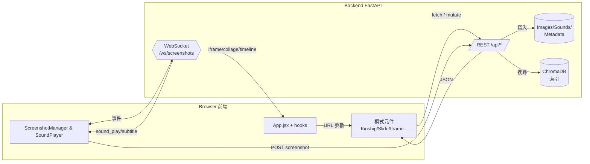

# 前端架構概論（Frontend Architecture Overview）

> 狀態: 與現況程式碼同步  
> 最後更新: 2025-11-23

---

## 1. 技術棧與整體流程

- **基礎環境**：Vite 5 + React 18。入口 `src/main.jsx` 只負責 render，所有模式切換、WebSocket、timeline/截圖/字幕邏輯集中在 `App.jsx` 與 hooks。
- **3D 與截圖**：three、@react-three/fiber、@react-three/drei 驅動 Kinship / Organic 場景；html2canvas 透過 `utils/html2canvasLoader.js` 供 Kinship/Slide/Iframe/Static/Video 等模式截圖，IframeMode 會覆蓋 iframe 內部的高品質截圖。
- **狀態處理**：以 hooks 組合（無 Redux/MobX）。共用模組：`useControlSocket` (WS) + `useControlSocketHandlers`、`useScreenshotManager`、`useSubtitleCaption`、`useSoundQueue`、`useRemoteTimelineControl`、`useCameraPresets`、`useSilentAudioUnlock` 等。
- **環境變數**：
  - `VITE_API_BASE`：API base，空值時走相對 `/api`。
  - `VITE_IMAGES_BASE`：影像路徑，預設 `/generated_images/`。
  - `VITE_CLIENT_ID`：預設 client id（可被 URL `?client=` 覆寫）。
  - `VITE_IFRAME_PERSIST_QUERY`、`VITE_COLLAGE_PERSIST_QUERY`：決定是否把 iframe/collage 設定寫回 URL。
- **外部互動**：REST + WS `/ws/screenshots` 來自 FastAPI；iframe/collage/timeline/episode 等設定皆靠後端 API，前端專注視覺與控制。

---

## 2. 目錄與核心模組

- `src/App.jsx`：解析 URL（含 `admin_mode` 優先）、決定 DisplayMode、掛上 `ModeLayout`。整合 `useScreenshotManager`（含 `window.__APP_CAPTURE_SCENE`）、`useControlSocket`、`useRemoteTimelineControl`、`useCameraPresets`、`useSubtitleCaption`、`useSoundQueue`，並用 `createModeRenderMap()` 把 mode→component/props/onCaptureReady 封裝。`useSilentAudioUnlock` 提供隱藏 audio 讓 `unlock_audio` 事件能啟動自動播放。
- `src/components/`：ControlPanel、ModeLayout、ScreenshotMessage、SubtitleCaptionStatus、IframeTimelineControls、SoundPlayer、AdminPanel（內含 SnapshotManager / TimelineManager / EpisodeManager），以及 `components/kinship/**`、`components/search/**` 等子結構。
- `src/modes/createModeRenderMap.js`：集中管理 DisplayModes 映射，含 Admin，並注入 before/after content（例：Kinship 的 ControlPanel 與截圖訊息）。
- `src/hooks/`：模式判斷 (`useDisplayMode`/`useModeParams`)、WebSocket (`useControlSocket` + handlers)、截圖 (`useScreenshotManager`)、字幕 (`useSubtitleCaption`)、iframe/collage 設定、相機預設、幻燈片播放、timeline 播放 (`useIframeTimelinePlayer`)、timeline 動作 (`useTimelineStepActions`)、遠端 timeline 控制 (`useRemoteTimelineControl`)、靜音解鎖 (`useSilentAudioUnlock`)。
- `src/utils/`：iframe/collage 解析與 query builder、collage 切片數學、slide 工具、html2canvas loader、`adminPanelUtils.js`（snapshot/timeline/episode 預設 payload 與預覽 URL）。
- `src/api.js`：所有 REST 呼叫集中於此，覆蓋 kinship/search/generate/collage/caption/tts/remote-control/timeline/episode 等。

---

## 3. DisplayModes 一覽

`useDisplayMode()` 依 URL 旗標決定模式（incubator 優先、admin_mode 位於最高優先序），未指定則為 Kinship。

- **KINSHIP**（預設）：`components/kinship/KinshipScene.jsx`，含 3D 群集、孵化室 (`?incubator=true`) 與 2D 親緣 (`?phylogeny=true`)，內建 FPS/相機追蹤/截圖註冊。
- **ORGANIC**：`OrganicRoomScene.jsx`，巡航 anchor、六面貼圖、類圖搜圖自動換 anchor。
- **SLIDE**：`SlideMode.jsx`，以圖搜圖或親緣列表輪播，支援加速/暫停/無限循環，最後一張自動成下一輪 anchor。
- **SEARCH**：`SearchMode.jsx` + `useSearch`，支援上傳以圖搜圖與文字搜尋，點擊結果可再搜尋。
- **IFRAME**：`IframeMode.jsx`，支援 grid/horizontal/vertical，面板拖拉調整比率，本地或遠端配置；搭配 timeline overlay。
- **COLLAGE**：`CollageMode.jsx` + `useCollageControls`，可接受遠端 config 鎖定或本地調整 rows/cols/image_count/mixPieces/stage size。
- **COLLAGE_VERSION**：`CollageVersionMode.jsx`，透過 `/api/generate-collage-version` 任務生成，輪詢 `/progress`。
- **GENERATE**：`GenerateMode.jsx`，用 parents/prompt/尺寸/格式 叫 `/api/generate/mix-two`，並能列舉 offspring。
- **CAPTION**：`CaptionMode.jsx`，全屏顯示 caption。
- **STATIC**：`StaticMode.jsx`，顯示單張全螢幕，可指定 `object_fit`/`object_position`、`img_base`。
- **VIDEO**：`VideoMode.jsx`，播放 `/videos/圖像系譜學Video/<file>`，支援 timeline/video_control 遠端操作與截圖。
- **ADMIN**：`AdminPanel.jsx`，分頁管理 iframe snapshots、iframe timelines、episodes（多 timeline 編排）；提供預覽 iframe snapshot 與 timeline 播放，以及 clone/覆寫/播放到特定 client。

所有模式包在 `ModeLayout.jsx`：統一處理 before/after content、`onCaptureReady` 注入、SoundPlayer、SubtitleOverlay、Info toggle（Ctrl+R），並尊重 `sound_player=false`。

---

## 4. URL / 狀態協調與即時事件

### 4.1 模式與參數
- `useModeParams` 解析 `img`、`slide_interval(_ms)`、`sound_player`、`client`、`iframe_timeline` 等，並標記哪些模式需載入 kinship 資料（iframe/slide/organic/static/video/admin 會跳過）。
- `DisplayModes` 優先序：`admin_mode` → `iframe_mode` → `slide_mode` → … → `video_mode`；`incubator` 直接鎖 Kinship，`phylogeny` 追加 2D 親緣。

### 4.2 Kinship 堆疊
- `useKinshipData` 呼叫 `/api/kinship?depth=-1`，最大 clusters=3。搭配 CameraTracker/FpsTracker/CameraPresetApplier 與 `useKinshipCapture` 註冊截圖。
- `useCameraPresets` 讀取/儲存/刪除視角，`ControlPanel` 在 Ctrl+R 顯示模式標籤、影像計數、FPS、相機資訊、字幕/說明文字。

### 4.3 截圖／WebSocket／音效
- `useControlSocket` 單一連線 `/ws/screenshots`，自動 hello + 2 秒重連，事件涵蓋 `screenshot_request/completed/failed`、`sound_play`、`subtitle_update`、`caption_update`、`iframe_config`、`collage_config`、`unlock_audio`、`remote_click`、`video_control`、`timeline_control`。
- `useControlSocketHandlers` 過濾 `target_client_id`，解鎖音訊時用 `useSilentAudioUnlock` 提供的隱藏 audio；remote click 支援 selector/child selector/座標 fallback；video control 直接驅動 `VideoMode` 的 controlRef。
- `useScreenshotManager` 排隊執行自動截圖（避免在 iframe 預覽模式重複觸發），失敗會回報 `/api/screenshots/{id}/fail`；並把 capture 函式掛到 `window.__APP_CAPTURE_SCENE` 供 iframe 內層呼叫。
- `SoundPlayer` 監聽 `sound_play`，必要時自動重取 `/api/sound-files`，並處理 autoplay 受阻的回退。

### 4.4 字幕／說明文字
- `useSubtitleCaption` 初始抓 `/api/subtitles`、`/api/captions`，之後靠 WS 更新；支援 `expires_at` 或 `duration_seconds` 自動清除。

### 4.5 設定 Hooks（Iframe / Collage）
- `useIframeConfig`：解析 URL、再向 `/api/iframe-config?client=` 取最新 snapshot（除非 `iframe_preview=true`），若收到 WS 遠端 config 會鎖定並更新網址（當 `VITE_IFRAME_PERSIST_QUERY=true`）。`releaseRemoteConfig` 會在 timeline 結束或離開模式時還原本地 config。
- `useCollageConfig`：載入 `/api/collage-config`，若遠端來源為 global/client 則鎖定控制台，並顯示 `remoteSource`。

### 4.6 拼貼/搜尋/生成
- `useCollageControls` 以 kinship 資料建立 image pool，切片並快取尺寸/邊緣取樣，支援 mixPieces 動畫。
- `useSearch` 上傳圖片（先 POST `/api/screenshots` 再查）或文字查詢，並可對結果再搜尋。
- `CollageVersionMode`、`GenerateMode` 共用 `listOffspringImages`；前者跑任務進度，後者包裝 mix-two 與輸出 URL。

### 4.7 Timeline／自動化
- `useRemoteTimelineControl` 處理 `timeline_control` 訊息與 URL `iframe_timeline`，可強制切換到 iframe 模式，透過 `commandId`/`sessionKey` 去重，提供 play/pause/stop/next/previous/reload，停止時釋放遠端 config。
- `useIframeTimelinePlayer` 下載 `/api/iframe-timelines/{id}`，依 step duration 排程，套用 snapshot config，支援 loopOverride、startStep、autoPlayOnLoad。
- `useTimelineStepActions` 在每步開始執行動作：unlock_audio、多 client subtitle/caption、TTS / speak_with_subtitle / sound_play、remote_click（selector/target/x,y + offset）、video_control（play/pause/seek/volume/mute + offset），並能中途 abort。錯誤會反映在 timeline overlay。
- `VideoMode` 透過 `controlRef` 支援 timeline/video_control 指令；`IframeMode` 截圖會先抓外層 DOM，再併入各 iframe 內部的高品質截圖。

---

## 5. 資料流（Mermaid）

- **URL 決策**：`App.jsx` 用 `useModeParams` 解析查詢參數後決定模式、clientId、timeline。
- **REST**：模式與 hooks 透過 `api.js` 叫 FastAPI `/api/*`（親緣、搜尋、生成、配置、timeline、episode、截圖等）。
- **WebSocket**：`/ws/screenshots` 轉送 screenshot_queue、音效、字幕/標題、iframe/collage 設定、unlock_audio、remote_click、video_control、timeline_control 事件到前端。
- **截圖/回傳**：各模式在 `onCaptureReady` 提供 DOM/Canvas→Blob，`useScreenshotManager` 依 queue 上傳 `/api/screenshots` 並更新訊息。
- **靜態資源**：圖片前綴 `VITE_IMAGES_BASE`（預設 `/generated_images`），音效透過 `/api/sound-files` 取得 URL。


```mermaid
flowchart LR
  subgraph Browser 前端
    A[App.jsx + hooks]
    B[模式元件\nKinship/Slide/Iframe...]
    C[ScreenshotManager & SoundPlayer]
  end
  subgraph Backend FastAPI
    D[/REST /api/*/]
    E{{WebSocket\n/ws/screenshots}}
    F[(Images/Sounds/\nMetadata)]
    G[(ChromaDB\n索引)]
  end

  A -->|URL 參數| B
  B -->|fetch / mutate| D
  D -->|JSON| B
  C <-->|事件| E
  C -->|POST screenshot| D
  D -->|寫入| F
  D -->|搜尋| G
  E -->|iframe/collage/timeline| A
  E -->|sound_play/subtitle| C
```

---

## 6. API 呼叫概覽（`src/api.js`）

- **Kinship/相機**：`fetchKinship`、`fetchCameraPresets`、`saveCameraPreset`、`deleteCameraPreset`。
- **搜尋**：`searchImagesByImage`、`searchImagesByText`；上傳圖片用 `uploadScreenshot` + `createImageUploadRequest`/`createImageSearchRequest`。
- **截圖佇列**：`uploadScreenshot`、`reportScreenshotFailure`。
- **拼貼/生成**：`fetchCollageConfig`、`saveCollageConfig`、`generateCollageVersion`（檔案版）、`generateCollageVersionFromNames`、`getCollageProgress`、`generateMixTwo`、`listOffspringImages`。
- **Iframe 設定/Snapshot**：`listIframeSnapshots`、`getIframeSnapshot`、`saveIframeSnapshot`、`deleteIframeSnapshot`、`cloneIframeSnapshot`。
- **Timeline**：`listIframeTimelines`、`fetchIframeTimeline`（可 `resolve=false` 拿原始定義）、`createIframeTimeline`、`updateIframeTimeline`、`deleteIframeTimeline`、`cloneIframeTimeline`、`playIframeTimeline`。
- **Episode**：`listEpisodes`、`fetchEpisode`（可 `resolve=false`）、`createEpisode`、`updateEpisode`、`deleteEpisode`、`cloneEpisode`、`playEpisode`（可傳 target map/command prefix）。
- **字幕/標題/音效**：`fetchSubtitleState`、`fetchCaptionState`、`fetchSoundFiles`、`triggerTts`、`speakWithSubtitle`、`queueSoundPlay`、`setSubtitle`/`clearSubtitle`、`setCaption`/`clearCaption`。
- **遠端控制**：`unlockAudio`、`sendRemoteClick`、`sendVideoControl`。

---

## 7. Admin 面板（DisplayModes.ADMIN）

- **Snapshot 管理**：列出/查看/儲存/刪除/複製 iframe snapshot（`/api/iframe-config/snapshots` 系列），即時預覽第一個 panel URL；支援調整預覽寬度。
- **Timeline 管理**：列出/載入/新增/覆寫/刪除/複製/播放 timeline，預覽第一個 snapshot（以 iframe 產生 `/` 預覽 URL），並可在頁面直接以 iframe_mode 播放完整 timeline。
- **Episode 管理**：Episode = 多 timeline track 的編排。支援列表、載入、建立/覆寫、刪除、複製、指定 target map/command prefix 後播放（實際會廣播多條 `timeline_control`）。
- 共同特性：JSON 編輯器有預設模板（`adminPanelUtils`），所有操作走 `api.js` 封裝；預覽 iframe 會帶 `iframe_preview=true` 避免循環截圖。

---

## 8. 互動與熱鍵

- `Ctrl+R`：切換資訊層（Kinship/Slide/其他模式共用）。
- `IframeTimelineControls`：遠端 timeline 啟用時出現，可播放/暫停/停止/前後段/重新載入。
- `VideoMode`：點擊或 Enter/Space 切換靜音；timeline/video_control 指令會驅動 play/pause/seek/volume/mute。
- `IframeMode`：點擊可開啟控制面板（僅在 controlsEnabled 時），截圖會合成 iframe 內外層，確保尺寸正確。

---

## 9. 效能與 UX 提示

- 3D 場景：共用材質/貼圖，必要時關閉動畫或降低 cluster 數；FPS 由 `FpsTracker` 回報。
- 截圖：IframeMode 會強制 scale=1 並修正 canvas 尺寸；VideoMode/StaticMode 皆用 html2canvas，注意跨域圖片需 CORS。
- WebSocket：單一 WS 共享所有事件，避免多處建立連線；長時間閒置靠 2 秒重連。

---

## 10. 開發與建置

- 開發：
  ```bash
  cd frontend
  npm run dev
  ```
- 建置：
  ```bash
  npm run build
  # 輸出於 frontend/dist/
  ```

---

## 11. Refactor / 後續可考慮

- 將 `api.js` 拆模組或加型別（漸進 TS），統一錯誤/重試策略。
- 抽出全域 `AppContext`（API base、WS 實體、錯誤提示）與 `ModeRouter`，讓模式元件更純粹。
- 大型模式可改 lazy import；Search/Grid 可加 lazy-load / prefetch。
- AdminPanel 可分拆 hooks，並加入 JSON schema 驗證（目前僅靠後端 Pydantic）。

---

## 12. 已知限制/注意

- Timeline / Episode 仍需手動編輯 JSON（無前端可視化流程編輯）；修改後需重新整理前端才會載入最新檔案。
- iframe/Collage 遠端設定與 timeline/episode 播放皆以 WS 廣播，若瀏覽器被 sandbox（例如內嵌 preview）會刻意跳過自動截圖避免循環。

（文件結束）
