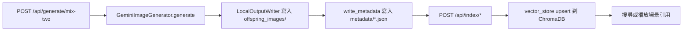
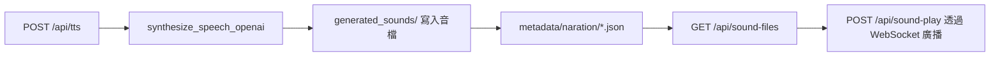

# 後端模組與檔案流

本文整理 `app/api/*.py`（HTTP 入口、驗證、回應）與 `app/services/*.py`（商業邏輯、I/O 及副作用）之間的責任分工，以及影像／聲音在「生成 → 儲存 → 索引 → 播放」各階段的資料流向與實體路徑。

## 模組責任分工
- `app/api/`：負責路由宣告、請求/回應模型與錯誤轉換，將工作委派給對應的 service。例：`generation.py` 只處理參數驗證與例外回覆，實際生成交由 `services.gemini_image`。`indexing.py` 只負責觸發索引函式，錯誤轉換為 HTTP 代碼。`sound.py` 亦僅包裝 TTS 與播放的服務呼叫。
- `app/services/`：封裝外部呼叫與檔案 I/O，例如 Gemini 影像生成與輸出檔案、ChromaDB 向量索引、OpenAI TTS 音檔寫入、即時播放廣播、設定快照讀寫等。

## 核心資料流（生成 → 儲存 → 索引 → 播放）

### 影像

- 生成：`GeminiImageGenerator` 在生成前確認 `offspring_images/` 與 `metadata/` 目錄存在，呼叫 Gemini 取得影像後透過 `LocalOutputWriter` 產生檔名並寫入生成圖，再用 `write_metadata` 產出同名 JSON。輸出包含路徑、尺寸與 prompt 等資訊。
- 儲存：生成圖檔固定寫入 `settings.offspring_dir`（預設 `backend/offspring_images/`），對應 metadata 則寫入 `settings.metadata_dir` 下的同名 `.json`。
- 索引：`/api/index/offspring` 會掃描 `offspring_images/` 取得批次檔案，逐張呼叫 `index_offspring_image`。該函式讀取圖檔與同名 metadata，生成向量後寫入 ChromaDB（位於 `settings.chroma_db_path`）。
- 播放/引用：前端取得檔名後透過靜態掛載 `/generated_images/{filename}` 讀取成品，或經 `/api/search/*` 依 ChromaDB 查詢。

### 聲音（TTS）

- 生成：`synthesize_speech_openai` 產生音檔，將檔名正規化後寫入 `settings.generated_sounds_dir`，並建立 narrations metadata（檢查碼、來源模型等）。
- 儲存：音檔存放於 `generated_sounds/`，對應 metadata 儲存在 `metadata/naration/`（或 `METADATA_DIR` 下的 `naration/` 子目錄）。
- 播放：`/api/sound-files` 列出檔案與 metadata；`/api/sound-play` 先確認檔案存在，再透過 `RealtimeBroadcaster` 廣播播放事件給前端客戶端。

### API 對應檔案路徑速查表

| API | 主要服務 | 讀寫路徑 | 說明 |
| --- | --- | --- | --- |
| `POST /api/generate/mix-two` | `services.gemini_image.generate_mixed_offspring(_v2)` | 寫入 `offspring_images/{timestamp}.png`；寫入 `metadata/{同名}.json` | 產生影像與 metadata，回傳檔名與模型資訊 |
| `GET /api/offspring-images` | 列舉 `offspring_dir` | 讀取 `offspring_images/` | 回傳可用生成圖清單與 URL |
| `POST /api/index/offspring` / `.../image` / `.../batch` | `services.vector_store` | 讀取 `offspring_images/` 與 `metadata/*.json`；寫入 `embeddings/chroma` | 將圖檔與 metadata upsert 到 ChromaDB，支援跳過已存在項目 |
| `POST /api/search/text` / `.../image` | `services.vector_store` | 讀取 ChromaDB；必要時讀取 `metadata/*.json` | 以文字或影像向量搜尋，回傳符合的檔名與 metadata |
| `POST /api/tts` | `services.tts_openai.synthesize_speech_openai` | 寫入 `generated_sounds/{base}.(mp3|wav...)`；寫入 `metadata/naration/{同名}.json` | 產生語音並附帶檔案摘要與 checksum |
| `GET /api/sound-files` | `api.sound_helpers.list_sound_files` | 讀取 `generated_sounds/`；讀取 `metadata/naration/*.json` | 列出音檔及其 metadata（若能匹配） |
| `POST /api/sound-play` | `RealtimeBroadcaster.broadcast_sound_play` | 讀取 `generated_sounds/{filename}` | 廣播指定音檔播放事件給 WebSocket 客戶端 |
| `POST /api/iframe-config/snapshot` / `.../restore` | `services.iframe_config` | 寫入/讀取 `metadata/snapshots/iframe_config/{client}/` | 將場景配置存檔或還原，供後續播放或排程引用 |

## 常見維護任務索引
- 清理：`services/cleanup_zh.py` 可定期刪除 ChromaDB 中的中文索引；手動一次性清理可呼叫 `cleanup_once()`。
- 重建索引：若 ChromaDB 資料毀損或模型升級，呼叫 `/api/index/offspring`（或在管理腳本中直接呼叫 `vector_store.sweep_and_index_offspring`）重新掃描 `offspring_images/`。
- 補齊缺圖/缺 metadata：針對單張遺失的向量或 metadata，同步檢查 `offspring_images/{name}` 與 `metadata/{stem}.json` 後，呼叫 `/api/index/image` 重新 upsert；若 metadata 缺失需先重跑生成流程或補寫 JSON。
- 快照還原：使用 `/api/iframe-config/restore` 讀回 `metadata/snapshots/iframe_config/{client}/{name}.json`，或用 `/api/iframe-config/snapshot` 建立新快照後再行複製/還原。
